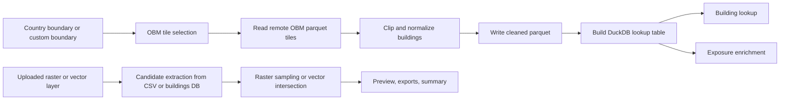

# Code README

This document explains how the main algorithms in the Data Augmentation app work, and where each stage lives in the codebase.

The main entry point is [building_lookup_app.py](building_lookup_app.py). It creates the Flask app, keeps track of the active lookup database, and registers the main feature modules:

- [obm_country_to_parquet.py](obm_country_to_parquet.py) for Workflow 1, which builds a cleaned building Parquet from OpenBuildingMap.
- [prepare_index.py](prepare_index.py) and the mirrored `prepare_index()` inside [building_lookup_app.py](building_lookup_app.py) for Parquet to DuckDB indexing.
- [custom_parquet_database.py](custom_parquet_database.py) for Workflow 2, which turns an existing Parquet file into a lookup database.
- [layer_upload_routes.py](layer_upload_routes.py) plus the [raster_intersections](raster_intersections) package for raster and vector intersections.

## 1. High-Level Data Flow

## 2. Workflow 1: OpenBuildingMap S3 to Cleaned Parquet

The OpenBuildingMap ETL is implemented by `OpenBuildingMapCountryETL` in [obm_country_to_parquet.py](obm_country_to_parquet.py).

### 2.1 DuckDB session setup

When the ETL starts, `_initialize_duckdb()`:

- opens the DuckDB work database
- loads the `spatial` and `httpfs` extensions
- configures threads, memory limit, temp directory, and disabled insertion-order preservation
- creates an S3 secret scoped to `s3://us-west-2.opendata.source.coop`

The ETL reads public OpenBuildingMap tiles from:

- `s3://us-west-2.opendata.source.coop/tge-labs/openbuildingmap/*.parquet`

This is not using a Python S3 SDK. DuckDB itself reads the remote parquet files through `httpfs`.

### 2.2 Boundary preparation

The boundary can come from three places:

1. A country selected from the catalog in [country_boundary_catalog.py](country_boundary_catalog.py)
2. A user-supplied `.gpkg`, `.shp`, or zipped equivalent
3. The legacy Germany fallback

`_create_country_boundary_table()` transforms the source geometry into `OGC:CRS84` and dissolves all features into a single geometry with `ST_Union_Agg(...)`.

That dissolved polygon is stored in a DuckDB table named `country_boundary`. The ETL then calls `_set_bbox_from_country_boundary()` to derive the WGS84 min and max lon/lat used for cheap prefiltering.

### 2.3 Selecting only the needed OBM tiles

The remote OpenBuildingMap dataset is partitioned by zoom-6 quadkey, so the ETL does not scan the whole bucket.

The selection logic in `_obm_input_paths()` works like this:

1. Compute boundary-intersecting quadkeys at the configured zoom.
2. Build candidate object names like `building.<quadkey>.parquet`.
3. Enumerate the actual remote objects with `glob(...)` when possible.
4. Drop synthesized tile names that do not really exist in the bucket.

This matters because the country boundary bbox can imply tiles that are not present remotely.

For large countries, `_effective_chunk_size()` increases the chunk size automatically so the ETL does not spend most of its time paying repeated temp-table overhead on very small batches.

### 2.4 Detecting the geometry representation

OBM parquet schemas are inspected dynamically by `_detect_obm_geometry_expression()`.

- If DuckDB reports the geometry column as WKB or BLOB-like, the ETL uses `ST_GeomFromWKB(geometry)`.
- If DuckDB already sees it as `GEOMETRY`, it uses the column directly.

That keeps the ETL tolerant to schema changes without hard-coding one geometry encoding.

### 2.5 Chunked extraction and clipping

The core algorithm is `_extract_clean_parquet()`.

For each chunk of selected OBM parquet files, it performs three stages:

1. Load bbox-filtered candidates into `_tmp_candidates`.
   - Reads only the selected parquet files.
   - Applies a cheap bbox overlap predicate against the dissolved boundary extent.
   - Avoids building full geometry objects for the entire global dataset at once.

2. Clip to the dissolved country polygon into `_tmp_country`.
   - Uses `COALESCE(TRY(ST_Intersects(c.geom, g.geom)), FALSE)`.
   - This is the first exact geometry test.

3. Normalize attributes and write a chunk parquet.
   - Parses height strings such as `HHT`, `H`, and `HBET` patterns.
   - Computes centroids in WGS84.
   - Projects footprints to `EPSG:3035` for metric area calculations.
   - Derives `footprint_area_m2`, `height_m`, `stories_*`, `occupancy_group`, `occupancy_quality`, `floorspace_est_m2`, and `attribute_completeness_score`.
   - Serializes geometry as `geom_wkb` in the parquet output.

Each chunk is written as ZSTD-compressed parquet, and all chunk files are merged into the final cleaned parquet at the end.

### 2.6 Output profiling

After the parquet is written, `_profile_output()` computes summary statistics and saves profiling artifacts such as:

- row counts
- area statistics
- occupancy and source distributions
- schema snapshots
- manifest metadata

Those outputs are written under the workflow's `profile` directory and `manifest.json`.

## 3. Parquet to DuckDB Lookup Index

The lookup database build is implemented in [prepare_index.py](prepare_index.py) and mirrored inside [building_lookup_app.py](building_lookup_app.py) so the web workflow can run the same logic with progress updates.

### 3.1 Buildings table creation

`prepare_index()` reads the cleaned parquet and creates a `buildings` table by:

1. Restoring geometry from `geom_wkb` with `ST_GeomFromWKB`.
2. Projecting each geometry from `EPSG:4326` to `EPSG:3035` as `geom_3035`.
3. Materializing both WGS84 and projected bbox values.
4. Deriving `quadkey_prefix_14` from the full quadkey.

The reason for storing both coordinate systems is:

- WGS84 geometry is convenient for map clicks and point-in-polygon checks.
- `EPSG:3035` is used for distance and area calculations in meters.

### 3.2 Indexes

The lookup DB adds three important indexes:

- `buildings_geom_rtree` on `geom`
- `buildings_geom_3035_rtree` on `geom_3035`
- `buildings_quadkey_prefix_14_idx` on `quadkey_prefix_14`

The quadkey prefix is an important coarse filter. It lets the app narrow the candidate set before running more expensive geometry predicates.

## 4. Workflow 2: Custom Parquet to DuckDB

Workflow 2 lives in [custom_parquet_database.py](custom_parquet_database.py).

### 4.1 Column inspection and mapping

`_parquet_columns()` uses DuckDB `DESCRIBE SELECT * FROM read_parquet(...)` to inspect the file. The UI then asks the user to map required fields:

- latitude
- longitude
- geometry
- occupancy

Optional fields include height, year built, construction, roof type, and basement. Up to 10 extra fields can also be carried through.

### 4.2 Geometry normalization

`_geometry_sql()` converts the mapped geometry column into DuckDB geometry based on its type:

- `GEOMETRY` stays as-is
- `VARCHAR`, `TEXT`, or `STRING` is parsed with `ST_GeomFromText`
- everything else is treated as WKB and parsed with `ST_GeomFromWKB`

That allows the workflow to accept several common parquet geometry encodings.

### 4.3 Building the custom lookup table

`prepare_custom_parquet_database()` builds the same `buildings` table shape expected by the rest of the app.

It:

1. Reads the parquet through DuckDB.
2. Casts mapped lat/lon and occupancy fields.
3. Converts geometry to `geom` and projects it to `geom_3035`.
4. Drops rows with invalid geometry or out-of-range coordinates.
5. Generates synthetic building ids like `custom_000000000001`.
6. Computes bbox values, footprint area, quadkey prefixes, and completeness score.
7. Creates the same R-tree and quadkey indexes used by Workflow 1.

It also creates a `building_display_fields` table so the UI knows which columns to show by default.

### 4.4 Local staging for network-share safety

If the output path is on a UNC or mapped share, Workflow 2 may stage the DuckDB build locally first and copy the finished file to the final destination. That avoids failures caused by DuckDB needing WAL and temp files beside the target DB on a network share.

## 5. Map Click Building Lookup

The frontend click handler is in [static/app.js](static/app.js). A map click sends:

- `lon`
- `lat`

to `/api/building-at` in [building_lookup_app.py](building_lookup_app.py).

### 5.1 Request path

`/api/building-at`:

1. validates coordinate ranges
2. opens a read-only cursor against the active lookup DB
3. calls `find_building(...)`

### 5.2 Candidate pruning with quadkeys

`find_building()` first calls `enrichment_quadkey_config()` to decide whether the DB has:

- `quadkey_prefix_14`, preferred
- or only `quadkey_prefix_6`, fallback

It then builds a point-specific quadkey filter with `_point_quadkey_filter(...)` so the later spatial queries only scan nearby tiles.

### 5.3 Exact matching algorithm

The lookup algorithm is ordered from cheapest reliable test to more expensive fallback:

1. `lookup_inside_polygon(...)`
   - creates a DuckDB point geometry
   - applies the quadkey prefix filter
   - applies bbox overlap against `bbox_xmin/ymin/xmax/ymax`
   - runs `ST_Intersects(b.geom, point.pt)`
   - returns the smallest matching footprint if multiple polygons overlap

2. If no containing polygon is found and the mode allows fallback, `lookup_nearest_polygon(...)`
   - builds a larger candidate search radius
   - preselects at most 200 nearby buildings by centroid distance in WGS84
   - transforms the click point into `EPSG:3035`
   - computes exact polygon distance with `ST_Distance(b.geom_3035, point.pt_m)`
   - returns the nearest polygon within the radius

3. In centroid-only mode, `lookup_nearest_centroid(...)`
   - searches by centroid distance only

This is why the lookup feels fast: the app does not run an exact distance check against the whole table.

## 6. Exposure Enrichment

Exposure enrichment also lives in [building_lookup_app.py](building_lookup_app.py).

### 6.1 Main strategy

`enrich_exposure_csv()` prefers one large DuckDB SQL job instead of a Python loop.

The normal path is:

1. Load the uploaded CSV into a pandas DataFrame.
2. Open the active lookup DB.
3. Determine the best quadkey prefix column with `enrichment_quadkey_config()`.
4. Build one SQL statement with `enrichment_select_sql(...)`.
5. `COPY` the query result directly to the enriched CSV.
6. Re-read only the needed columns to build summary statistics.

The SQL assigns each exposure row one of these match types:

- `inside_polygon`
- `nearest_polygon`
- `nearest_centroid`
- `none`

### 6.2 Remote database staging

If the selected lookup DB is on remote storage, the app tries to stage it locally before enrichment.

`stage_remote_lookup_database()` chooses between:

1. full file copy to a local cache for smaller databases
2. subset extraction for larger databases

The subset extraction path is important. `extract_remote_db_subset()`:

- computes the quadkeys covering the uploaded exposure points
- merges those quadkeys into prefix ranges
- attaches the remote DB read-only
- copies only matching `buildings` rows into a temporary local DuckDB file

That keeps enrichment usable over slow SMB shares without copying a very large DB every time.

### 6.3 Fallback path

If staging fails, the app falls back to row-by-row lookup with `lookup_exposure_row(...)`. That is slower, but it preserves correctness.

## 7. Raster Intersection

Raster intersection routes are registered from [raster_intersections/routes.py](raster_intersections/routes.py). The frontend control flow is in [static/raster_intersections.js](static/raster_intersections.js).

### 7.1 What the frontend sends

When the user runs a raster intersection, the browser sends:

- the uploaded raster layer id
- the active map bounds
- the selected raster band
- optional threshold and threshold operator
- either exposure upload metadata or the active building database context

The map is not sending an arbitrary drawn polygon. The current implementation uses either:

- the visible map area
- or the full raster extent

The backend intersects those bounds with the raster extent before doing any sampling.

### 7.2 Candidate extraction

The backend chooses a candidate source first.

For exposure:

- `prepare_exposure_map_cache(...)` creates or reuses a small local DuckDB cache of upload coordinates
- `query_exposure_candidates(...)` selects points whose lon/lat fall inside the requested bounds

For the building database:

- `query_database_candidates(...)` reads building centroids from the `buildings` table within the same bounds

This step is purely coordinate-based and is intentionally cheap.

### 7.3 Raster sampling algorithm

The actual raster sampling is in [raster_intersections/sampling.py](raster_intersections/sampling.py).

`sample_candidates(...)` tries two backends:

1. `rasterio` plus `pyproj`, preferred
2. `gdallocationinfo`, fallback when rasterio is unavailable

For each candidate point, the algorithm:

1. reprojects lon/lat from `EPSG:4326` into the raster CRS if needed
2. samples the requested raster band
3. drops masked, non-finite, or nodata values
4. applies the optional threshold filter
5. emits a result row with the sampled raster value and the original candidate context

Results are then summarized by [raster_intersections/results.py](raster_intersections/results.py), exported to CSV, Parquet, and GeoJSON, and reduced to preview map features.

## 8. Vector Polygon Intersection

Vector uploads are prepared in [layer_upload_routes.py](layer_upload_routes.py).

### 8.1 Preparing the vector layer

When a user uploads a GeoPackage, shapefile, or GeoJSON, `_prepare_vector_layer()`:

1. reads the dataset with DuckDB Spatial
2. transforms geometry to `EPSG:4326` if needed
3. forces 2D geometry
4. stores features in a local DuckDB cache table named `features`
5. materializes bbox columns and simple indexes

### 8.2 Intersecting points with polygons

The actual point-in-vector algorithm is `intersect_vector_candidates(...)` in [raster_intersections/duckdb_queries.py](raster_intersections/duckdb_queries.py).

It:

1. inserts the candidate points into a temporary DuckDB table
2. joins those points to cached vector features
3. applies bbox overlap first
4. then applies exact `ST_Intersects(f.geom, ST_Point(c.lon, c.lat))`
5. keeps only the first matching feature per candidate point

If the chosen vector field is numeric, its value is also exposed as `raster_value` so the rest of the summary and export code can reuse the same pipeline shape as raster sampling.

## 9. Why the App Uses This Structure

Several repeated design choices show up across the codebase:

- Cheap prefilters before exact geometry work.
- Local temporary DuckDB files instead of repeated network I/O.
- Dual geometry storage, WGS84 for map logic and `EPSG:3035` for metric calculations.
- Chunked ETL writes to keep memory usage bounded.
- One large SQL statement for enrichment where possible, instead of Python row loops.

Those choices are what make the app usable on large building datasets without requiring a separate database server.

## 10. Files Worth Reading First

If you want to understand the code quickly, start in this order:

1. [building_lookup_app.py](building_lookup_app.py)
2. [obm_country_to_parquet.py](obm_country_to_parquet.py)
3. [custom_parquet_database.py](custom_parquet_database.py)
4. [raster_intersections/routes.py](raster_intersections/routes.py)
5. [raster_intersections/duckdb_queries.py](raster_intersections/duckdb_queries.py)
6. [raster_intersections/sampling.py](raster_intersections/sampling.py)
7. [layer_upload_routes.py](layer_upload_routes.py)